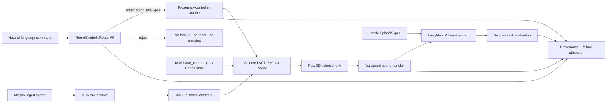

# LangMani v1 architecture

LangMani separates physical task truth, language interpretation, policy selection, continuous
control, and verification. This prevents language strings from leaking into visual observations and
makes rejection a first-class no-dispatch outcome.

## Trust boundaries

1. **M1 task truth** — reset `TaskSpec` and `EpisodeSpec` define the physical episode; natural
   language never enters numeric observations or per-step info.
2. **Language safety** — a rejection contains no executable TaskSpec and returns before controller
   lookup, reset, policy inference, or simulation.
3. **Frozen skill library** — the deployed low-level library consists only of six selected PerTask
   ACT controllers. Language confidence never changes continuous actions.
4. **Action audit** — raw, binary-transformed, projected, and executed actions remain separate.
5. **Counterfactual evaluation** — the same physical scene is paired across tasks and across Oracle
   and learned routing, enabling exact attribution of language versus control failure.
6. **Immutable evidence** — dataset, run, checkpoint, prompt, parser, schedule, and verifier
   identities use canonical serialization and cryptographic fingerprints.

## What v1 deliberately does not claim

- It is not a general-purpose robot foundation model.
- It does not train on free-form internet language or new robot tasks.
- It does not hide unsafe behavior behind clipping or aggregate success.
- M5A physical validity does not imply that the final quality gate passed.
- M5B's structural bridge does not imply a real LatentGuard proposal or executed action.
- SmolVLA was not started because the sealed final quality gate failed.
